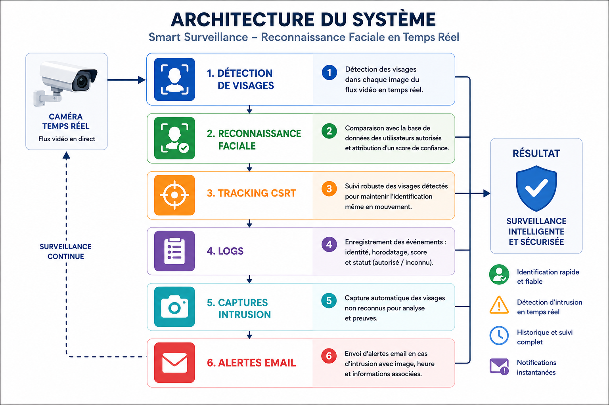
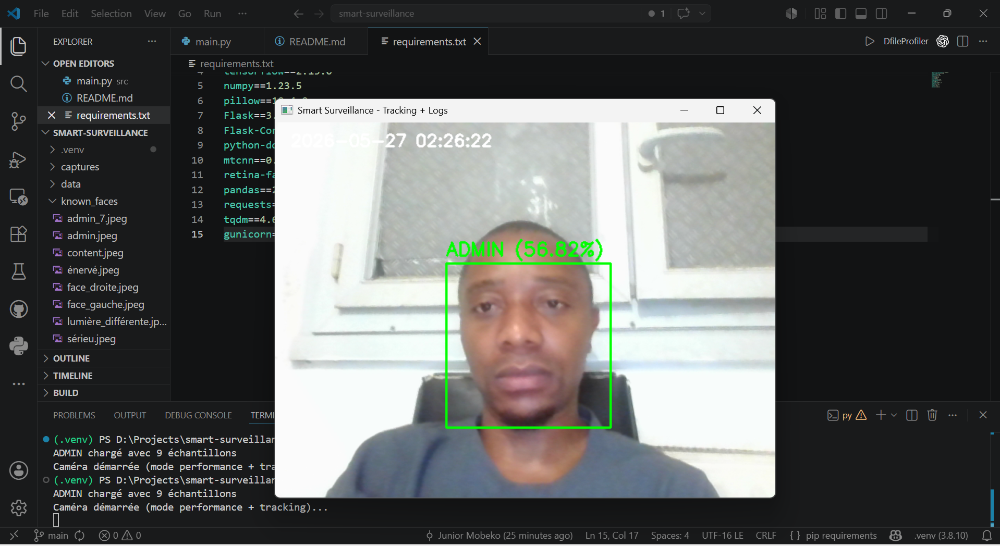
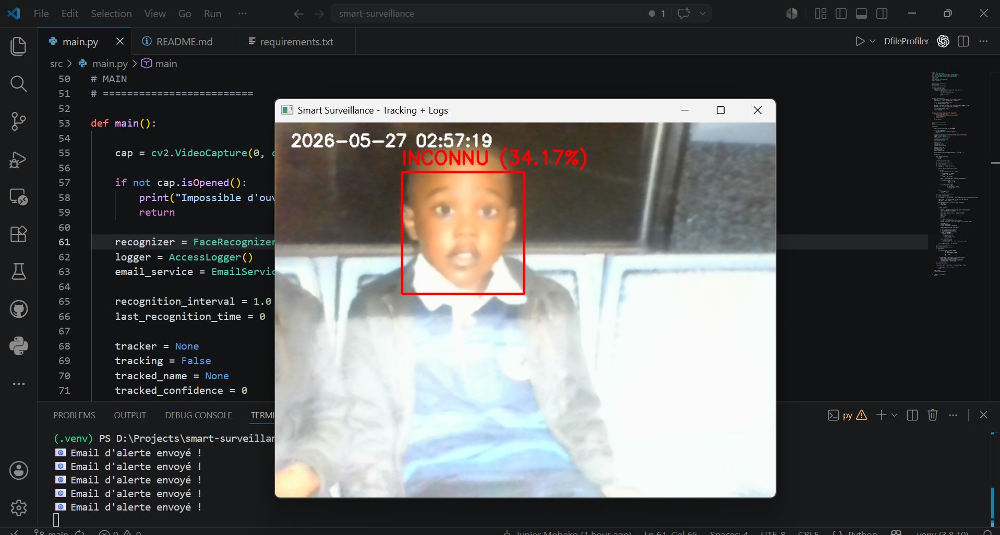

# Smart Surveillance AI

🇫🇷 Version française  
🇬🇧 English version available in [README_EN.md](README_EN.md)

---

# Présentation du Projet

Smart Surveillance AI est une plateforme de surveillance intelligente en temps réel basée sur l’Intelligence Artificielle et la Vision par Ordinateur.

Le projet combine plusieurs technologies d’analyse vidéo afin de créer un système capable de :

- détecter des personnes en temps réel
- reconnaître des visages connus
- identifier des individus inconnus
- détecter des mouvements suspects
- enregistrer les événements de surveillance
- envoyer des alertes intelligentes

Contrairement aux systèmes de surveillance classiques qui se limitent à enregistrer des vidéos, cette plateforme cherche à analyser et comprendre automatiquement les flux vidéo en direct grâce à l’intelligence artificielle.

---

# Objectif du Projet

L’objectif principal de ce projet est de développer une plateforme de surveillance intelligente capable d’assister automatiquement les systèmes de sécurité modernes.

Le projet possède également une dimension recherche et expérimentation dans les domaines suivants :

- Intelligence Artificielle
- Vision par Ordinateur
- Analyse Vidéo Temps Réel
- Deep Learning
- Systèmes de Surveillance Intelligents
- Smart Monitoring Systems

Ce système est conçu pour évoluer progressivement vers une plateforme complète de surveillance intelligente orientée recherche et applications industrielles.

---

# Fonctionnalités Actuelles

## Reconnaissance Faciale Temps Réel

Le système est capable de reconnaître des individus enregistrés à partir d’une caméra en temps réel.

Lorsqu’un visage connu est détecté :
- l’identité est affichée
- un score de confiance est calculé
- l’événement peut être enregistré dans les logs

Les personnes inconnues sont automatiquement identifiées comme inconnues.

---

## Détection de Mouvement

Le système analyse les mouvements présents dans le flux vidéo afin de détecter une activité dans la zone surveillée.

Cette fonctionnalité permet :
- d’optimiser le traitement vidéo
- de réduire les traitements inutiles
- d’améliorer l’efficacité globale du système

---

## Détection de Personnes

La plateforme détecte automatiquement la présence humaine dans le flux caméra.

Cette fonctionnalité servira également de base pour :
- le tracking intelligent
- l’analyse comportementale
- la détection d’intrusion
- l’analyse de foule

---

## Système de Logs

Tous les événements importants sont enregistrés automatiquement :

- date et heure
- détections
- reconnaissances faciales
- alertes
- événements système

Le système permet ainsi de conserver un historique complet des activités détectées.

---

## Système d’Alerte

La plateforme intègre un système d’envoi d’alertes capable de notifier certains événements importants comme :

- détection d’un inconnu
- activité suspecte
- détection particulière

---

# 🏗️ Architecture du Système

Le pipeline principal du système fonctionne de la manière suivante :

```text
Flux Caméra
      ↓
Détection de Mouvement
      ↓
Détection de Personnes
      ↓
Détection de Visages
      ↓
Reconnaissance Faciale
      ↓
Logs + Alertes
```

Chaque composant fonctionne dans une architecture modulaire permettant :
- l’évolution du projet
- l’ajout de nouvelles fonctionnalités
- l’intégration de nouveaux modèles IA

---

## 📊 Diagramme d’Architecture



---

# Technologies Utilisées

| Technologie | Utilisation |
|---|---|
| Python | Langage principal |
| OpenCV | Traitement vidéo temps réel |
| face_recognition | Reconnaissance faciale |
| Dlib | Encodage et détection faciale |
| TensorFlow | Support IA / Deep Learning |
| NumPy | Calcul numérique |

---

# Structure du Projet

```text
smart-surveillance-ai/
│
├── src/
│   ├── modules/
│   │   ├── face_detector.py
│   │   ├── face_recognizer.py
│   │   ├── motion_detector.py
│   │   └── person_detector.py
│   │
│   ├── services/
│   │   ├── email_service.py
│   │   └── logger_service.py
│   │
│   ├── utils/
│   └── main.py
│
├── models/
├── logs/
├── data/
├── requirements.txt
└── README.md
```

---

# Installation

## Cloner le projet

```bash
git clone https://github.com/Mobeko14/smart-surveillance-ai.git
cd smart-surveillance-ai
```

---

## Créer un environnement virtuel

```bash
python -m venv .venv
```

### Windows

```bash
.venv\Scripts\activate
```

---

## Installer les dépendances

```bash
pip install -r requirements.txt
```

---

# Lancer le Projet

```bash
python src/main.py
```

---

# État Actuel du Projet

Fonctionnalités déjà implémentées :

- Surveillance temps réel
- Reconnaissance faciale
- Détection de mouvement
- Détection de personnes
- Système de logs
- Alertes intelligentes
- Architecture modulaire

---

# Améliorations Futures

Le projet continuera d’évoluer avec plusieurs améliorations prévues :

- Intégration de YOLOv8
- Tracking intelligent avec DeepSORT
- Base de données PostgreSQL
- Dashboard web FastAPI
- Déploiement Docker
- Monitoring Grafana
- Support multi-caméras
- Analyse comportementale
- Détection d’intrusion
- Optimisation Edge AI

---

# Perspective Recherche

Ce projet est également conçu comme une plateforme d’expérimentation et de recherche autour de :

- l’analyse vidéo intelligente
- la surveillance automatisée
- les systèmes intelligents temps réel
- les architectures IA distribuées
- la vision par ordinateur

L’objectif à long terme est de transformer cette plateforme en véritable système de surveillance intelligent capable de fonctionner dans des environnements réels.

---

# 📷 Captures d’Écran

## ✅ Reconnaissance d’un Utilisateur Autorisé

Le système reconnaît automatiquement les utilisateurs enregistrés et affiche leur identité avec un score de confiance.



---

## 🚨 Détection d’un Individu Inconnu

Les personnes non enregistrées sont automatiquement détectées comme inconnues afin de renforcer la sécurité et la surveillance intelligente.



---

# Auteur

Edouard Junior Mobeko

Étudiant en Master 2 Informatique — Parcours Expert en Informatique et Systèmes d’Information orienté Cloud Computing  

Intelligence Artificielle • Vision par Ordinateur • Systèmes Intelligents • DevOps

---

# Licence

MIT License